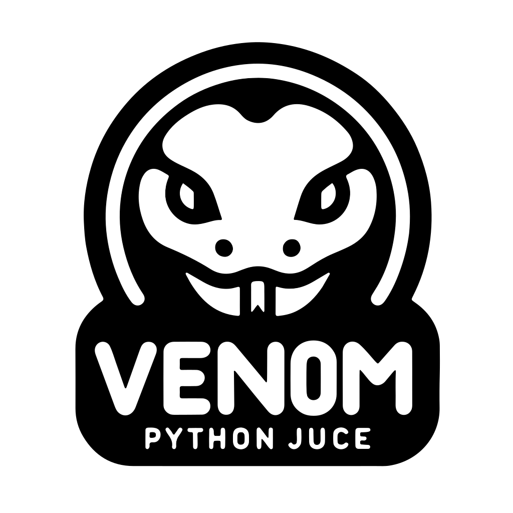

<!-- PROJECT LOGO -->
<br />
<div align="center">
  <a href="https://github.com/aszokalski/venom">
    
  </a>

<h3 align="center">VENOM - Python JUCE</h3>

  <p align="center">
    A Pythonic way to build VST3 plugins using JUCE
    <br />
    <a href="https://aszokalski.github.io/venom/readme.html"><strong>Explore the docs »</strong></a>
    <br />
    <br />
    <a href="https://discord.gg/8ZubDpaH">Join our Discord</a>
    ·
    <a href="https://github.com/aszokalski/venom/issues/new">Report Bug</a>
    ·
    <a href="https://github.com/aszokalski/venom/issues/new">Request Feature</a>
  </p>
</div>


<!-- TABLE OF CONTENTS -->
<details>
  <summary>Table of Contents</summary>
  <ol>
    <li>
      <a href="#about-the-project">About The Project</a>
      <ul>
        <li><a href="#built-with">Built With</a></li>
      </ul>
    </li>
    <li>
      <a href="#getting-started">Getting Started</a>
      <ul>
        <li><a href="#prerequisites">Prerequisites</a></li>
        <li><a href="#installation">Installation</a></li>
      </ul>
    </li>
    <li><a href="#usage">Usage</a></li>
    <li><a href="#roadmap">Roadmap</a></li>
    <li><a href="#contributing">Contributing</a></li>
    <li><a href="#license">License</a></li>
    <li><a href="#contact">Contact</a></li>
    <li><a href="#acknowledgments">Acknowledgments</a></li>
  </ol>
</details>


<!-- ABOUT THE PROJECT -->
## About The Project

VENOM is a Python port of the [JUCE framework](https://github.com/juce-framework/JUCE) using [pybind11](https://github.com/pybind/pybind11). Unlike other existing ports ([popsicle](https://github.com/kunitoki/popsicle)) it allows building **VST3** and **AU** plugins - **NOT** just standalone apps. 

It achieves this by _extending_ a C++ JUCE project with a Python module. This allows you to write the critical part of your plugin in Python, while still having all the build options available in JUCE.

And the best part is that it is simple to use. Just write a Python script, run it through venom's CLI build tool and you have a VST3 plugin ready to be used in your DAW.
### Why?

VENOM is not just a port of JUCE to Python. It is a new way to build audio plugins. Alongside JUCE bindings it provides a new **Pythonic API** that drops the C++ code style and makes it easier to use. Benefits of this approach include:
* **Rapid prototyping** - Python is a high-level language that allows you to quickly test your ideas
* **Easier to learn** - Python is a language that is easy to learn and use so much more people can start building audio plugins without the need to learn C++ (eg. artists, audio engineers, etc.)
* **Potential for use of machine learning** - Python is a language that is widely used in machine learning and data science. This opens up the possibility of easily using machine learning in audio plugins


<p align="right">(<a href="#readme-top">back to top</a>)</p>


### Built With
Some main technologies used in the project:
* [JUCE framweork](https://github.com/juce-framework/JUCE)
* [pybind11](https://github.com/pybind/pybind11)
* [CMake](https://cmake.org)

<p align="right">(<a href="#readme-top">back to top</a>)</p>


<!-- GETTING STARTED -->
## Getting Started
To get a local copy up and running follow these simple example steps.

### Prerequisites

- Python 3.11 or later
- A C++11 (or later) compiler (eg. g++, clang, etc.)
- CMake 3.5 or later
- JUCE dependencies (see [JUCE documentation](https://github.com/juce-framework/JUCE/blob/master/docs/Linux%20Dependencies.md))


### Installation
The project is not yet available on PyPI so you need to install it from the source.

1. Clone the repo
   ```sh
   git clone https://github.com/aszokalski/venom.git
   cd venom
   ```
2. Initialize the submodules
   ```sh
   git submodule update --init --recursive
   ```
3. Create a virtual environment
   ```sh
    python3 -m venv venv
    source venv/bin/activate
    ```
   
4. Install the package
   ```sh
    pip install .
   ```

<p align="right">(<a href="#readme-top">back to top</a>)</p>


<!-- USAGE EXAMPLES -->
## Usage

Example project in `example/` folder.

```shell
cd example
```
### Build the project
```shell
venom build
```

It will generate `build` and `dist` folders:

- `build` folder contains the build system files
- `dist` folder contains the built binaries

> Note: this may take a long time
> 
_For more examples, please refer to the [Documentation]()_

<p align="right">(<a href="#readme-top">back to top</a>)</p>


<!-- ROADMAP -->
## Roadmap
The project is still in the early stages of development. Here are some of the things that need to be done:
- [x] Basic JUCE bindings
- [x] Build system
- [ ] Pythonic API
- [ ] More JUCE bindings
- [ ] Documentation
- [ ] Tests


See the [open issues](https://github.com/othneildrew/Best-README-Template/issues) for a full list of proposed features (and known issues).

<p align="right">(<a href="#readme-top">back to top</a>)</p>


<!-- CONTRIBUTING -->
## Contributing

Contributions are what make the open source community such an amazing place to learn, inspire, and create. Any contributions you make are **greatly appreciated**. If you want to learn more about the architecture of the project, please refer to the [Documentation]().

If you have a suggestion that would make this better, please fork the repo and create a pull request. You can also simply open an issue with the tag "enhancement".
Don't forget to give the project a star! Thanks again!

1. Fork the Project
2. Create your Feature Branch (`git checkout -b feature/AmazingFeature`)
3. Commit your Changes (`git commit -m 'Add some AmazingFeature'`)
4. Push to the Branch (`git push origin feature/AmazingFeature`)
5. Open a Pull Request

<p align="right">(<a href="#readme-top">back to top</a>)</p>


<!-- LICENSE -->
## License

Distributed under the GPLv3 License. See `LICENSE.txt` for more information.

<p align="right">(<a href="#readme-top">back to top</a>)</p>


<!-- CONTACT -->
## Contact

Adam Szokalski (creator) - szokalskiadam@gmail.com

Mateusz Modrzejewski (project mentor) - mateusz.modrzejewski@pw.edu.pl


<p align="right">(<a href="#readme-top">back to top</a>)</p>


<!-- ACKNOWLEDGMENTS -->
## Acknowledgments

This project was created on Warsaw University of Technology by Adam Szokalski and is maintained by students taking Advanced Python Programming course by dr inż. Mateusz Modrzejewski.

This project would not be possible without the help of:
- [dr inż. Mateusz Modrzejewski](https://repo.pw.edu.pl/info/author/WUT4141ba381fef47aa8de9d92b59ff95b2/Mateusz+Modrzejewski;jsessionid=EA2F3857E3687CF12E0975119CB22C12?lang=pl&tab=main&affil=IN&cid=3050553) [@mamodrzejewski](https://github.com/mamodrzejewski)
- [mgr inż. Łukasz Neumann](https://repo.pw.edu.pl/info/author/WUT7244d020213e4e41ac349f81b7b6f3b0/%25C5%2581ukasz%2BNeumann+title?affil=IN&r=publication&lang=pl)

<p align="right">(<a href="#readme-top">back to top</a>)</p>
