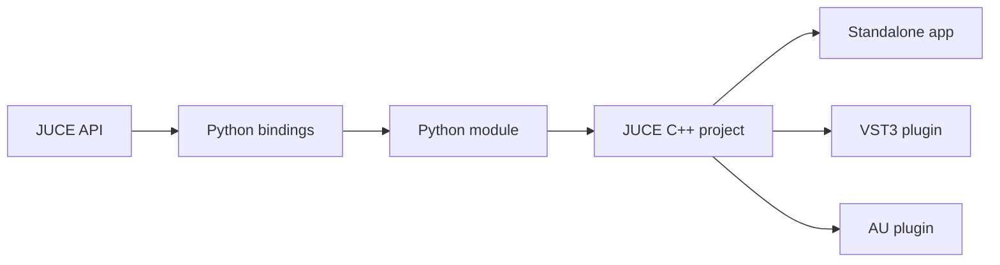
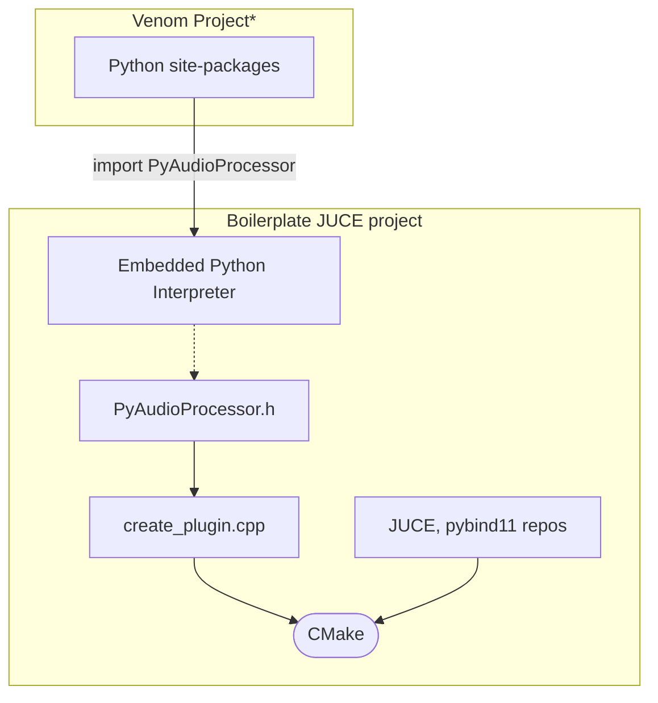

# Architecture

In this section, we will discuss the architecture of VENOM. We will start with the high-level overview of the project and then we will dive into the details of each component.

## Why C++ to Python binding isn't enough?
A VST3 plugin is a shared library compliant with the [VST3 standard](https://steinbergmedia.github.io/vst3_doc/vstsdk/index.html). It is loaded by a DAW and it communicates with it in a way defined by the standard.

While it is possible to compile a Python script into a shared library (using [Cython](https://cython.org)) it would require a lot of work to make it compliant with the VST3 standard - redeveloping the whole VST3 SDK in Cython. 

Then JUCE offers building not only VST3 plugins but also AU plugins, standalone apps, and more. It would take a lot of time to make it all available in Python.

So if the JUCE build system already exists in C++ and it is a standard in the industry, why not use it? We can just extend it with Python.

This is the main idea behind VENOM. It is a Python module that extends a C++ JUCE project. It allows you to write the critical part of your plugin in Python, while still having all the build options available in JUCE.

### Binding

### Extending

We will dive deeper into the details of extending in the [Extending Chapter](Extending.md).

## High-level overview
To make this process simple for the end user VENOM is divided into 4 main components (and 3 Python modules):
1. **JUCE bindings** (venom.juce) - a set of bindings for the JUCE framework.
2. **Pythonic API** (venom.wrapper) - a wrapper around the JUCE bindings that makes it easier to use.
3. **CLI tool** (venom.builder) - a command-line interface tool that allows you to create a new project, build it, and run it.
4. **Boilerplate JUCE project** (part of venom.builder)- a template for a new JUCE project extended with Python.

### Architecture diagram
The architecture is shown in 2 connected diagrams for better readability __(* is a reference to the other diagram)__.

```mermaid
flowchart TD
	152669["JUCE bindings (venom.juce)*"] -->|"import"| 723442["Pythonic API (venom.wrapper)"]
	723442 --> 895135["Python scripts"]
	895135 --> 875456(["build"])
	487898["venom.yaml"] --> 875456
	585430(["init"]) --> 691501["Venom Project"]
	875456 -->|"generate python package"| 961549["PyAudioProcessor package"]
	961549 -->|"install PyAudioProcessor"| 140590["Python site-packages"]
	875456 -->|"setup project"| 855236["JUCE project"]
	691489["Boilerplate JUCE project*"]
	855236 -->|"build"| 164500[("Plugin bundle (MacOS)\nPlugin installer (Windows, Linux)\n.")]
	140590 -->|"copy"| 164500
	subgraph 709261["CLI tool (venom.builder)"]
		691489 --> 875456
		585430
	end
	subgraph 723442["Pythonic API (venom.wrapper)"]
	end
	subgraph 691501["Venom Project"]
		524020["PyAudioProcessor.py (entry point)"] -.- 895135
		487898
		140590
	end
	subgraph 242985["Build directory"]
		961549
		855236
	end
	subgraph 152669["JUCE bindings (venom.juce)"]
		761419["JUCE, pybind11 repos"] --> 329334(["CMake"])
		811082["JUCE pybind11 bindings"] --> 329334
	end

%% Mermaid Flow Diagram Link
%% Keep this link to make future edits to your diagram
%% https://www.mermaidflow.app/flowchart#N4IgZgNg9g7iBcoB2UAmBTAzgg2qGAlqgC4AWCAzAAwBMANCKegQOanEI20NEIgCMAVhoA2EQE4QDAA5RMBYgShIEoAB4IA7IJEA6fgA5BmmhQAsZgxRoHxDAJ4J+43eO0Wa-ChUHjBtgF8GVABDYhDVEAgQgCN0CD4AKQBVAGEAUQACGIIkVFyWTEyACgA3dBQAW10AKwBXAGN0AEopEHyAJ3QGxWU+ABUAITaUDGx4HBADfn4qAxo2zRF+M2c263FvMxAAXQYOkKQAa0wAEQOYFUQgkAPjpxkQrqRiACVDo4QqBnRUFixcKBiPZpOg+A06phiFBKm1Kk8jugOgBlcIdDjwEBQUEqBjwjqIjrpPJ8WS5Dg8F5IkI9JRIADqRDInG+ICh9ggYMQbOIHSgiMZJHI8H4N0wUDqHSafCWKzWDHFkqaAAlDqhOXwFgw0f8MSANls2jr0MRVXkNZitSBeJjfv8ALQiVaaCiaSxUcQ0QRtQ4EeHEX4IMAhCCYdDBMIRbnsi2TKF8xHwADEMX4qZiIl2DGicQgguZ8BoZmzsXiyuYbAxRZ4mHS+UUSBYQZDYbF8W6AdQzdD6CCQJBXJAEKhMLhCKRqKeeuxFTHBKRxK7mLJLza5OptOU+eFXAVwItoHj-PQ26cYolUsH01m8zaisvZvVg6txr1BvMRqeusfFoEa6XIB2ug9pFoYVj8CI8x+D6SB+mEgbwMGPYRuEkQxlyca8seybpmmmZ7Natb1gU3ZhiWuanoWxZRKWEDlqw7CcGYbacj0CFIa2BGoBcqIclyvJ1L22oDnwmB1DELAHNI5B7nxqgsR27EtuGICyPIvRIAAgjE4oQHUAaRBo8DaHohjGKYFhWDYdggI4IouG4ggeF4Ph+IEwQHCwLAkYhyl9iAhBCpQ3CMBWjGFiFNogJoHqiPwbRqQodKGZQni6CYnr8FwIiCLljkOAgghUFQujGBQbjUJomxWJoNyhKh3I5vEfCpAAMgAkpk0JQBAJTlFUugxHUBAQBgHStAwowAhMIASCsthtAY7g6G0-hOdQWY8nx4w4ARdwnOcISXPJ+wfA8qlPBUbxnfArJATt-aguCkLQrCeLjiiaLTjic6EoupJQOSa5Ugcm4MkyO6suhaFYQKENngqF7Spic2WJIiNKugP7Pp+HS6nwS1OSt2pfia2Oav+fBAfami08sthzNMmYML6-pKch7SRjDckzUeiYpmmeGbQQRFJY2pFCWy7ZsUuHG9lxPH7vxHSCTcwJPZiYkSVJMlS6xnYSzIchJco2m6fpXLqKl-DpTQmXZblvjaAV8BFSVZUVVQVUUDVdWed54u+T2-mBQW1D0KFDFVpFAEmOYZhWolGkpcZFA226XA6G5sxUBQLvmAY+i0FQZhzEVkEGCIdVc41tF8AACvYZDKAQDSZJp9edWUFQwroMBSaC40jGg027bJnI7XtHxnBcVzADc+3ndIl0vO89y3R5R28RaAmS+rg5a5JITSXe0sG0HZHtP7Ply0b6l0mbPUWynLrpwnVBZ-4Od57ZlCWEXXBS5GCoBXKuId4bwHDgwJgUcWQRyinNIq8U74mzniAIy4hC4GDMJBGKwhZjLFMC7e01hdAUCdOITYXAhCUK8NXBqoAmoJExAANR7pUTI9c+Q1A7MPMYuAQCWE0LYAwi0-BeG9AwFYH9xBUFWkWYum10KT1OscGeR054LxuvwR4zxrrr1ZNxLeSsEC7x+H8Uej1BzDler9CcX0+AzlxCAfEf0SSYiccDAMoMNKUV3FtA8PIEwnggTo9oItpDRDstaJAEBchgnPJjPgwhS5cDvEjLGapfwvlJnqWwggJG42-FkwcyDrQAWpgYKpMVNh+B9szEArN4JLjMZzBhASMJBOwgLdM+FyLxD8dRJh9FKxMRrHWMWTYL6SzDPrdmnE1YiU1uJI+J8FRn3mSpIxXkb7KRQRpR+ekDLcgwVgnBS0P6eBAVlH+dkSE0DIRQqhVAaHiDoeAoKkCQowNGRFeBAEix2yMAlY2ycTkIBELTXQtAILFUhTMfwNk7LLD0EVKwtBhFmBdGYCg9CoyMLrpiQYw1RqZE6B2KAHRHCTRHjtEA4hlhOXRlMXKpg+kdJUbcaeh1jrXFUZ8EUuirprwFYYxWPNd6LI1myFZOtT5zNlns1SoKH46Sfscq28BIWaGhZ4EQcLNAItsC7FFpU5jh0xdi3Fm8dmBzlh8sO3ywrR3+ZqT0GKQX3z6OC+AIEvS6BoF6INNAXRFVpoIF2ZhxBmDNdQSF5gwLRsEHiyITC+CDEBpyDokT4KZBSBkTI0huG8JpfwmabolhRraJQiQ0w2iGATiICgbQvTkNWNWqp8xNBKKVpy-a6jeXz35UvFe+jRXmP+A9EA+9nojjei4j6k50SOJ+u9ecRJ3HKqBpSbxNJfEQP8dDaMsMQmfNFBjS8fAa2YLKfeFUJSKYkzxiaPgDbRDNqfcU80pTKa2gsfaN5vhRBulmCsGCcFz6tPqvijpAi+boBwoLDMwtRYNimfa9ZCqJb+RnZiGxo412EiXd9WchGFybpXBSGJu6wZ+KhiY49wTKJhPyJgHN0TchxKQAki9yMBDYPfekzG5NLRFJfZaQQbaymvhE3+HgFT-1OiAeYBNbpwNs0VRzaD3NYxdP5rhZDBEmGDP6XRZ1YzCITLQ9hzDilNOtjoFY2dtiyOfSnCu0jC713-WXIDVcO6Nz7s+Yehjh4T3McSZeiTUmhMPgfaJz94nopYooWJ008WQBWiipUyubhhHkPIcypp59b5tJg0ezCwTEO9N2ApGWNmnN4ZegRrzRGHEeNXa18jAFKNeMC3SOj49LZ6dPQWc9bIMlXs7SG2L97v2PunbkmUKWq2JfS-NhL5Sqb-tMHMQNXsdAvPU80w2ZWdOdPg9VoWOw6slb8grYxEqVZ7yWTK7Wx9dazLs6d7ZAd0NKqTqq82Gr0EID9YIANQbhAhp8F7Z2v94BRpjUVON2LE1mGTQ6nc-BNDQPM-AAwrIorXj2561BKcwl2XKim2uuYkhpCyNIewOQ8gzGyLkfIjZsBDb7dy2eJ0Lp6JFedIxMBt7K1VsJaVXQeiHBYJyAAciPeV33pn7KB+q4bRltA6rMnHSy1hjUI-8K4dwCcXK+ERX7EItr-sc2XnopXGBX3CDEJILHThKF49gQTonsdlirGZYD71mrWR2QRTTgldPMT5vSHQQtzOOds66GpO8vbcBTzUTyzRQrV7aM3mLhjkqpeDhl+ERsivle2fq2rq+Nu-uneD1pNVRytdaB0PoIw+vLCG6RU4cwpunLm+8Jb8QNwHdXSd6U13EgQAe5FOQ73vyTDyb4O+bY6uQ+g5FMYMhswE4j9kRjqqLto3pRip4SubofCQoMJHmi0eQCpAALIhERGn7aGf+UDpz4L4V+e69C8ntJdp1XtpARoIAp8EpR0oDMQhBRBZ9q87t7cVVTYW9n4fU3kKBdAo0A9IIvZXQsUXYZgY03QdB9VCcqpXdaobUG9pl59PAI1I5flCdV8UY3k0YycwVNVypSoCEloo1MEfZbkEAE4A1ZFhE6YfAixCdmIUIYM00iVM0kQc0Aw80GdC1i0egP8J4v8uUs9+c+U-88914WNxUd5nspVS8Ow5dK9nckDNlaDdkUCvVm9gc29IFlgA1ypbA-AcofCP4XYnIHlK4Us5gE5ZEjBx8YDldMQak4o59HMApQlF9mDwoV8ttMRCYMcGkm8KcuB9AipLB-BIJJMCliCcccDDVAEqkxAfYaCztadmpMQhoRouwec9D+1s8BcJ8TCBUzDHsLCQDcNVIICoDc9iBYDopYplgVca9Ssm9DkMDNULAbYloGU3BNhS5o0jATVDBoUMcccqoxBaAixrdbcGtkiz1Uifl0jXVMQ1ocU5FN80FtdXA1o3Am1DiZhNgKidUsUsoS5aim0jAx95DU1CUYkFAdDR5M8DpDCh1jCx0RdzCJcXtpVwCIBICq89ZVcFjUC3DNcU4NhdBcFCc3BiovYPRqJkV9iS4ClaYGV9VA1rU68Lja9ejJjYjpjPRZj58VhqJbiMRWDMjBEloREuDkofUvAyEZEyiXRKEBMRD4AGUcDIIIIE15psEq5wSmjmEQB+pe57AQhKgEgOiJg4Sf8ejR1hdBVADxdTFLCS8+Ay9bD0BxikSpjEEjsHD7MVJFj0CQcjIZgHl4D5htiipfAxATUY1Zg04L8PQqlNhWTftnCHN8BQkMcl9woRTidxEfBJSt9gybYnQQ0PRXQTBLB9VccEcixXAqyRA7YCkiwYpxttM9SG4m5SBlBMhMAGgOgCBpBiBucOVOi+cNFrShcADRcHT4Bi9QDpcbCK93ScSvt5iAcCSligynBZgcD8kqoRFqBMEaSwd-iNTw4Ud8FDBzi6CFiYjnd2ChAjt+S3BszhS-dX1S5fBnjlVXCU5VSspsELl9tfB5gXZhEA15gjAUs0UJAGj2yo9miQBG5m4kBeyFBgJl4GgjgbcARzSx59D4SJyjDOTbSBigChj0TrDZdlyPTOSvTAMfTcT1yXDUEtyPDnAY1HIfB3A04rkmC7IMdXAcdK4hAvjxS5C2Tby-IkjQ4dxIU3yEBcyAIUlFEXiKdC45h4DDVqAlp8CDB84IdA1MEQEbAIIoJk1dTEL9TG5NI6h8goAuEoAmhMBxQOgSgroqVC0-NiAJpRyLTv9uiSKbTpzUTHThjXtXTaLVyNk-SXj2KKcIJXAbByolgClqoS4XYQinRphdLiorB5hc4by0z-T7zBxvT4oGDXRFLfc2D6VGVVtfzycfUfAyFLAso3kJBGzS5lScVoVrBIyvZ9UnQsodTGjrLOy7KHKnKXK3LC0aQcL-gYTecDDiLETSLQrBi0SrCXSlz5cVz7DmLkDL4Az3CX4spHk3AgVS58sTVfBSogEvZK4vZjziq7UAcyrNQIjgV+SLAarlKCZWVyFCzXjKA9Aqk3YcUio3kuBlSfjdA9LRBVhS4cFypLLxqH8kLY9NCoAeFtD8LLSgr1qQrTCC9Zz5yRior9q6LPrLRvrJEjrHCmqDlAyPCdLXAQF9Uip9tDVwLyEyFsFyDPR0r5g3q7d0yrixsbj8cMiooK1Ut1LpT9V9Bj96SvAJDsE-j3jCdyoP5RqRL79FCn9X938CbAqEToipzSb7Si8nSFzBxMTsTDq1zjr-TNzWaU5HQIcXqnJw0-BKE+8tULqcEZgQFyo05myxbG9abMt3UZsGDcp-qPzMRr061FaVi9Ao0XlVijyrAGUTyvlSSPYsouBZFiozirLMb9T0hKg4hUAMBUBOEuyez2oQYi0TQkQAAdZxZRMc1awdS2--a2mc22iKxcmi6mmKrDDk92s6n1e0ES9KHwG8FYINV0QO4QCHWFDHIwRs4RPwKOjkmOu2LgeO2S0JSuJOuqt9JtEGlOAoiRUwIQTFS-aNcCtYwrd+ATYRa8yuo22y+ypQGarANy3QT7dPAKwiq04Kq2-osm0eqi3aieuwsEX0xvWeok+ezOaFMu7KPwMuXY43MQNqyk6NOKSFMa1M96+3Y+uO7tfkiQK+0U1tEau+6UwuSwWQvwHFWo2mAu4h-JNGkyyFGwSShCqu8ELoeCAAfUiTqADl0AaGkGkGWr7qIoHomLIvgeAMQcxCppQbmNdqcOoZOowdb09uyiXpMAxTtkbMTKCK8J8NRusC9EbNZPou5JPo9RfJsiFKUuTvpWm27XTu3zTlJJykjMKogkZIEqUuwPIRMA1NEFoAThoENshNj3jyZxZ1QGT3QDUm7tUcga6Its0c2oou2udL0b2oMbQdryofFrdtcISvnucGwLyjdCdEk28EoViddihWAqsDECqi8AaI8YfNjtPvofPuC2KhqpdGvq6eKjYc1VNSMB9hWEkyqhxQLtkQeXIQKQsABK2HScf3rj0gDmyDqG-RKFfwaAAHlkQ-Le7inxyNGkTbSxUtrwrdGysYgQgwwPSXamaGn0HmmPafU1nJNpgMd16dnT9aBHlDmLAdLzAAgGCFm0iMRMWopqBpDE4CSU5tT0ohBV6e8UtlTZFsCbBXGvACEQ078-7ITzn5HchMhcgoQQws0ShGQ8hYBMB49Wpcg6g1BmhCmzaoGibB6+ivhtHKKdrMRoN-nAWp68SlVQWZ7wW57NViXDVDmZDzAlhKXc5ILaW05TLhF0WCJ7pAR7bnMWtXF7F3MOtPNHWN0esfK+sfEBsD16MeYwsmNQlIs+NZRA9ZtMkNtMs0s187ZDQ1tZMssFMHQRqXQ3RySvRjsjGMaKsRsrtDNTMTMq6RlwpqxLNiITGZlYrLiRj8N503XiMPNnE3WfMt1-NqN+stxfWhsYZA2z1g2rxQ7bxeMI2nwFtXwY3kyN9Ftn11tR24Df1AIdtVgqk05IImzM2QWa4wseZKtukDN2URYrMSqC2D0hlaJi2qxJLgW-ScNXta27E3Nl0XWm2PoW3esAtvXO3Znu3GNjwIth2XcEDmU70R3slo24iLIE40tZMylst-1ZFocuAXR1iN24rs2GNd39MkN2VjMIFeai38dS3D3y3GnTM+A-RZBl1btNlb3pV73XMG3n2H233PWP290fXv3YNf24Y+2AOIP44rQQOE3wOph8yGaZMMtYOk3gJvBXR8qdBQJUOfst2uPMOEMelrtxkSObNGab2kia3ms63F12ssROtm2KNWP23P3wZOOj0A2-2g2+PROCkCzh3hO1sCZloGkJPI2pPtsHQu1hrhFbBZiWZYINNlP2kc3LsNP82y3JkdPr3q273DOH3GPTPXXX2LPt0rP2Ov2CwQt-WRt-2JsklMQhEJS3OMsckZ3POiZvPckYOF3qZw7II05MEiwGbitN2ouMPc3YuD3UMSrqO9PGshxUuGOTPPFXMWOcv1xrPBsuP7OeOxt+3kloKNoqvI2av8ZHykFoPJPmv4P1TGyRLZEitwuTt6mVPouT083Buj2K2Rvku6OJuutH2SMX3vNsu235u8ubOCu-XAl4MSuQO+BUYFotu52o2POsivODvtujuHRaZZQGYqkIIlPrveud3+v92UNHvGnnv6D9OUu500upuzOsuPW5uQZ-vFu7PivHPSuosph4eoewPYf6qhBGqfPoe-O-0AvCFDiE4dAyluu0PxHbuqsBvNpcPZmRBTML2LNiOEva8jb-huMDg1CmdUL5rsLcLEjdOXvrE3v62KfMvvvqffvafaMu2lvGfePme+MGVufgOMl3Pp3duBAvzZEEfofE3-PgInRTjPjtBjBMfStJe+uYu8ejNaI6Mf5hlCPqIVfrM1fISOXwgsSm6pqgG+RZrKVDekviexv6P3v0vpv3vZvreaMgtAef3lvRthRxswe4f6vw2Pfx2sigaGuZ2Pe4PkfzWXlyFA0sUI-1Wbvo+7uZe4+KJQkcdFfk+tPVfSsjawxiA6hpAca8aOAieMNS-TfjPnWMuvu3EAJK+-vbfbPQsHextggIkolyPYl4ki-JsHiFE0l2ecZOf8lCl43Du6qOWC5LUmhYNJxePzSulLz3bYdZe8fU9ovx9xEchuT3OpvvztZNYyek3Y-pX3M7n9Osl-OvpDAb639m+a3S0HQw74ADPeSWCHsyl56-h+ei7B0FGXdQSByokETHlBkn448Y+MAgiKn2PZV1C2SfRAVeyrYl90B43TAeX3N6n9usAMGnrXw47197eIPUJPfzYyP9MQnGF-mQO94yIfyQnariJ1TrSZGuVAgfsBErgFxCc2pSuOPy0zcDdMvAmrLPwGS+sayIg35EgIJ6nYjaFHSlMQBz6ANHK+fEBoXz34yUD+0gs3tgMp6W8FBNfDtgDyIGqDwsTPVvvSg2Jp0neoHb-tQL1A30P0BQproAPg40JgMqwbOpwOeyQCp+0vWPsvzT4YYjeEggzjEKP5PsT+zHH7lRgIHKDUhDPNQWeg0HsYn+XGHjLkNfQCZb6X-MdktmiysN-+vnJHkHwsDmodmOOKduAKx7lZ6h0A1wSe2CxntcwSvKiE0OG6oCohkgsvrEK6E4CqeiQvoTb0IEshiBww1bk5xYbto5hm2LvslkrR0DzBiPMoQF1yy0whmhWBwZfCj48Dp+sfSIcHBJ6vcOh66CvvELP5PCvWdPO3kMPSGO9MhmCKpDNl+Ew8Chy2QEX7w56ilqYu2eYEh0Oxi9LuWbWEc4PhF8DEREtdoS5hkFxCLemI3zIoOSH08b+Hw0gU5yMDCBgapInbklgggY5lmywvnqsPtC2Ad6bAwNFlGhFbInBF2dkYcKEEQJ9UCA7wSn2QGkcJGLRElF2E5FCRohPIu4Z9x6FW9nhSg-LoMNFH4jPhUwuAj70MHu9jBnPeUW7CpE-pQRwECESjwgjGAcE2ouoXCIaF8CjhBYfwCaJLZmjfB6fR-A0GxCOBbRtHE3qiLax8i5B7rLEWxyv4qC8Rvbb0ZkMlFspKBII8kZiDxbQ5Qxr6FUTgjECrByoOOJijsMj66i4M+ozToaM+TGiCOogi4RWzI5Wi2iRfcQWgO5EOtOhTombr0OxGViPRRXMUQjB9GTMPUpIswbV19EGD2xm2SwQvVDpFgMcpcWYHGPQ4JiDh12fMciMLEOjVxjbZ0eWNy5bi3haQmseKP3HSJvyjY-3iJ1bGBpzxcmGkf+hxzkI12JcYRF12ZE9c9hT4rDgaLl4piDKk400dOItFG0cxTOBcdPXtQERSgBAdADAEo4YhNUhgbApBEwTrRdaXVYhBDnKj+1lgrodKjwwYAAAvKAKOFuilRr8UaI4lGiMBFhcUdUAgDbgOCVBn8JoEIKcBU7kowYAwYYAwDAB8gXgr+YgN4kiCKBiAv4U4HJKPgcJ+gCgDULJLLwEBygnKHMZUEqBXRHJ0QVyrCRuCHs1AtE+uIcHiD3Mfoc5WoSAHlxQB-mEAOsP8H6BLJQAqAOoCGD8HxIYp0qXSLwAnToBX866FKQ7Us45joAHQPgDLxuBhSIpU+HKUZMio1MDqqDIcD1EL6YgkwlJSkm0H+bYVJIEoPIKkHqmFTGpYAfqQNNamUoxo3UgqUVOamKiQAMQYaUiH6CkBW4RwbjK5VEg9R0phEVSZgCYA3sAgQAA
```

### JUCE bindings
JUCE bindings are a set of pybind11 bindings for the JUCE framework. They are located in the `venom.juce` module. A detailed description of that module and a tutorial on how to contribute to it can be found in the [JUCE bindings chapter](JUCE-bindings.md).

### Pythonic API
The Pythonic API is a wrapper around the JUCE bindings that makes it easier to use. It is located in the `venom.wrapper` module. A detailed description of that module and a tutorial on how to contribute to it can be found in the [Pythonic API chapter](Pythonic-API.md).

### CLI tool and Boilerplate JUCE project
These two components are responsible for the whole building process. They are explained in detail in the [CLI tool chapter](CLI-tool.md) and the [Boilerplate JUCE project chapter](Boilerplate-JUCE-project.md).

This is a high-level overview of the building process:
1. The user creates a new project using the CLI tool (init). Read: [VENOM project structure](VENOM-Project-Structure.md).
2. The user writes Python scripts that use the Pythonic API.
3. The user runs the CLI tool (build) to build the project.
4. `venom.builder` generates a Python package from the Python scripts and installs it in the local Python site-packages.
> This allows the scripts to be visible from the C++ code
5. `venom.builder` sets up a new JUCE project using configurations from `venom.yaml` and the boilerplate JUCE project.
6. `venom.builder` builds the JUCE project. During this step all local Python `site-packages` are copied to the build bundle so they are available when you ship the binaries. A copy of the Python interpreter is also included in the bundle.
> This is nescessary because the plugin may use some external libraries that are not available on the user's system (e.g. Numpy)
7. The user can run the standalone app or install the plugin.

## Next steps
- [JUCE bindings](JUCE-bindings.md)
- [Pythonic API](Pythonic-API.md)
- [CLI tool](CLI-tool.md)
- [Boilerplate JUCE project](Boilerplate-JUCE-project.md)
- [VENOM project structure](VENOM-Project-Structure.md)