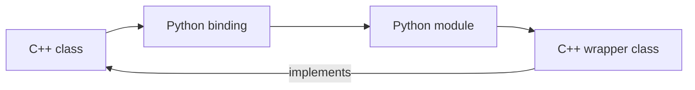

# Extending
_Extending_ in VENOM means a **2-way binding** - an object is defined in C++, extended in Python, and then used in C++ again.

## Before you start
This chapter assumes you are familiar with the **pybind11** library. If not, please read the [official documentation](https://pybind11.readthedocs.io/en/stable/). 
We'll be focusing mostly on classes so make sure you understand this section: [Classes in pybind11](https://pybind11.readthedocs.io/en/stable/advanced/classes.html)
## How extending works?
1.  **C++ to Python binding**
    1. A (virtual) base class _ClassX_ is defined in C++,
    2. A Python binding _ClassX_ is created for it,
    3. (in Python module _ABC_) Python class _PyClassX_ that inherits from _ClassX_ is created. Here it can implement / override the methods of _ClassX_ in Python.
2.  **Python to C++ binding:**
    1. _PyClassX_ derived form _ClassX_ is created in C++. It includes a pointer to an **embedded Python interpreter**.
    2. It imports the _ABC_ module and creates an instance of _PyClassX_ using the embedded interpreter.
    3. It implements all the methods of _ClassX_ by calling the corresponding methods of _PyClassX_ from the Python module.
       It can also call the methods of _PyClassX_ from the C++ code.
       > It also has to cast the input arguments and return types.

## Example
This example uses [pybind11](https://pybind11.readthedocs.io/en/stable/) to handle the binding and embedding of the Python interpreter.
> Author: mgr inż. Łukasz Neumann

<tabs>
    <tab title="MyClass.h">
        <code-block lang="C++">
    <![CDATA[
    #ifndef MY_CLASS

    class MyClass {
    public:
        MyClass() {}
        virtual ~MyClass() {}
        int add(int a, int b) { return a + b; };
        int sub(int a, int b) { return a - b; };
    };

    #endif // !MY_CLASS
]]>
</code-block>
        <note>
            This is the base class that we want to extend in Python. (Step 1.1)
        </note>
    </tab>
    <tab title="MyClass.cpp">
        <code-block lang="C++">
    <![CDATA[
#include "MyClass.h"
#include <pybind11/pybind11.h>

namespace py = pybind11;

PYBIND11_MODULE(example, m) {
py::class_<MyClass>(m, "MyClass")
.def(py::init())
.def("add", &MyClass::add)
.def("sub", &MyClass::sub);
}
]]>
</code-block>
        <note>
            This is the Python binding for the base class. (Step 1.2)
        </note>
    </tab>
    <tab title="my_altered_class.py">
        <code-block lang="python">
    <![CDATA[
from example import MyClass

class MyClassAltered(MyClass):
def one(self):
return 1
def add(self, a, b):
return a + b + self.one()

if __name__ == "__main__":
cl = MyClassAltered()
print(cl.add(1, 2))
print(cl.sub(1, 2))

]]>
</code-block>
        <note>
            This is the Python module that extends the base class. (Step 1.3)
        </note>
    </tab>
    <tab title="MyClassAltered.h">
        <code-block lang="C++">
    <![CDATA[
#include "MyClass.h"
#include <pybind11/embed.h> // everything needed for embedding
namespace py = pybind11;

class MyClassAltered : public MyClass {
private:
py::module_ altered_module;
py::object altered_class_instance;
public:
MyClassAltered() {
this->altered_module = py::module_::import("my_altered_class");
this->altered_class_instance = this->altered_module.attr("MyClassAltered")();
}

        int add(int a, int b) { return this->altered_class_instance.attr("add")(a, b).cast<int>(); };
};
]]>
</code-block>
        <note>
            This is the C++ class that wraps the altered Python class (Step 2)
        </note>
    </tab>
    <tab title="main.cpp">
        <code-block lang="C++">
    <![CDATA[
#include "MyClassAltered.h"
#include <iostream>
#include <pybind11/embed.h> // everything needed for embedding
namespace py = pybind11;

int main() {
py::scoped_interpreter guard{}; // start the interpreter and keep it alive

    auto my_altered = MyClassAltered();
    std::cout << my_altered.add(1, 2) << std::endl;
    std::cout << my_altered.sub(1, 2) << std::endl;
}

]]>
</code-block>
    </tab>
    <tab title="CMakeLists.txt">
        <code-block lang="cmake">
    <![CDATA[
cmake_minimum_required(VERSION 3.5...3.26)
project(example_binding)

find_package(pybind11 REQUIRED)  # or `add_subdirectory(pybind11)`

pybind11_add_module(example MyClass.cpp)

target_compile_definitions(example
PRIVATE VERSION_INFO=${EXAMPLE_VERSION_INFO})

add_executable(example_binding main.cpp)
target_link_libraries(example_binding PRIVATE pybind11::embed)
]]>
</code-block>
    </tab>
</tabs>

