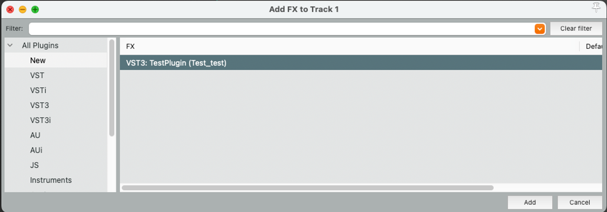

# Test plugin

<!-- TOC -->

* [Introduction](#introduction)
* [Testing flow](#testing-flow)
* [Tests directory structure](#tests-directory-structure)

<!-- TOC -->

## Introduction

In `tests` directory after build step, vst3 plugin is created. This plugin can be imported to DAW and used.
We will present how to build the plugin and import it to Reaper.

## Build instructions

1. Build the test plugin using `cmake`.

```shell
# in main repository directory
mkdir build
cd build
cmake -DPython_EXECUTABLE=$(which python) ..
```

> _Optional_: You can use `cmake -DPython_EXECUTABLE=$(pyenv which python) ..` if you are using `pyenv`.

2. Build the plugin.

```shell
cmake —build . —target TestPlugin_VST3
```

3. Plugin is created in `build/vst3/TestPlugin.vst3`. `cmake-build-debug/tests/vst3/TestPlugin_artefacts/Debug/VST3`
   TODO: validate this path

## Importing to DAW (REAPER)
1. Open Reaper and go to settings `Preferences -> Plug-ins -> VST`.
   1. Add the path to the directory where the plugin is located using `Edit path list` button.
   2. Click `Re-scan` to scan the directory for the plugin.
   
2. Now add plugin to the track.
   1. Right-click on the track and select `Insert virtual instrument on new track`.
   2. Select the plugin from the list.
   
3. Plugin is added to the track and you should see the plugin window.
   
